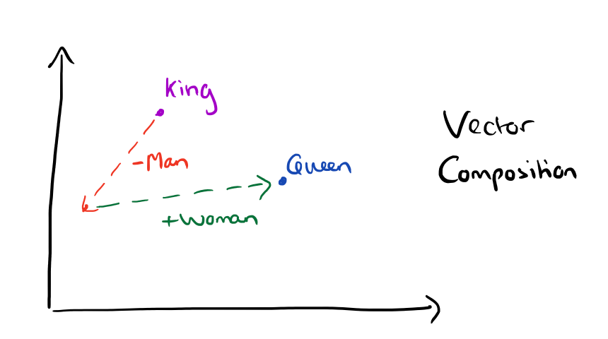
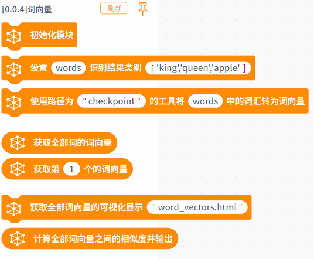
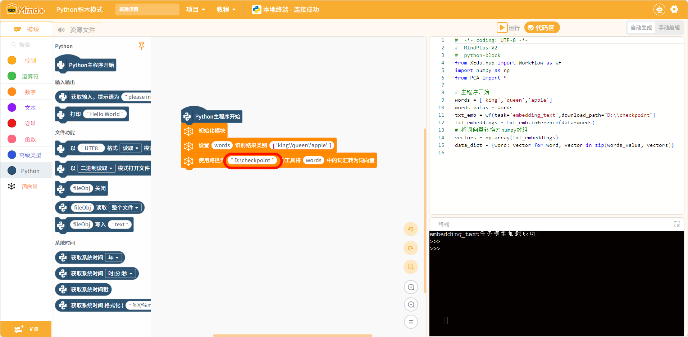
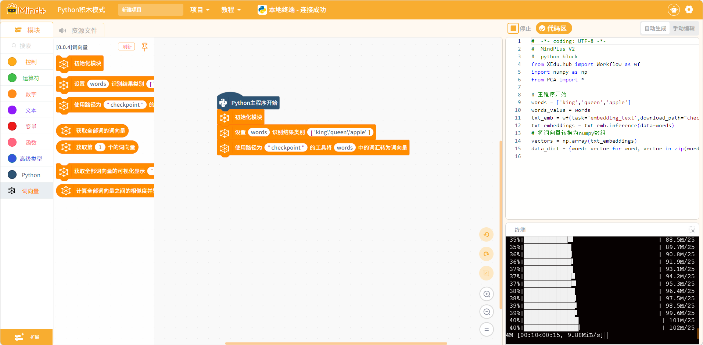
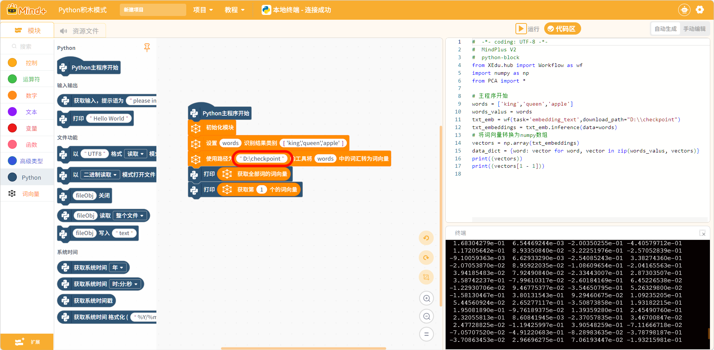
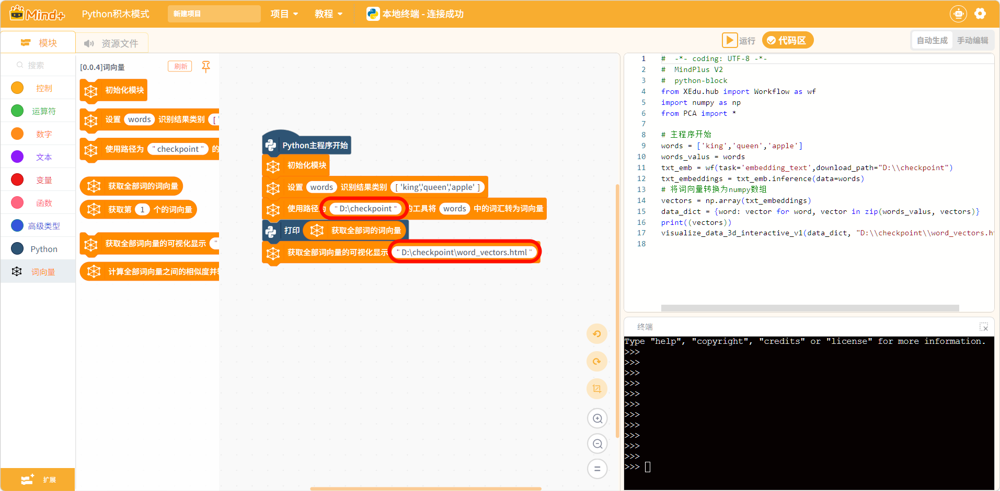
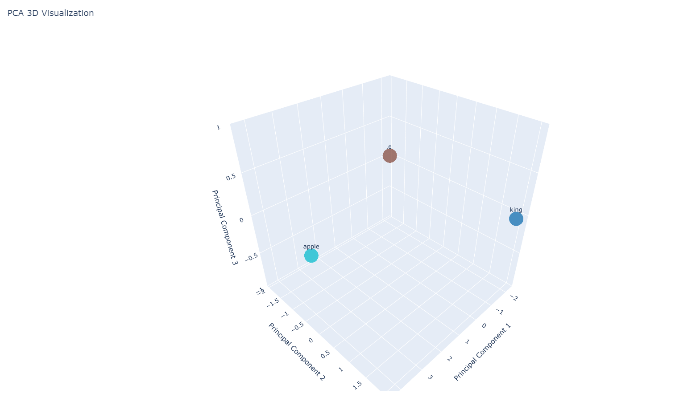
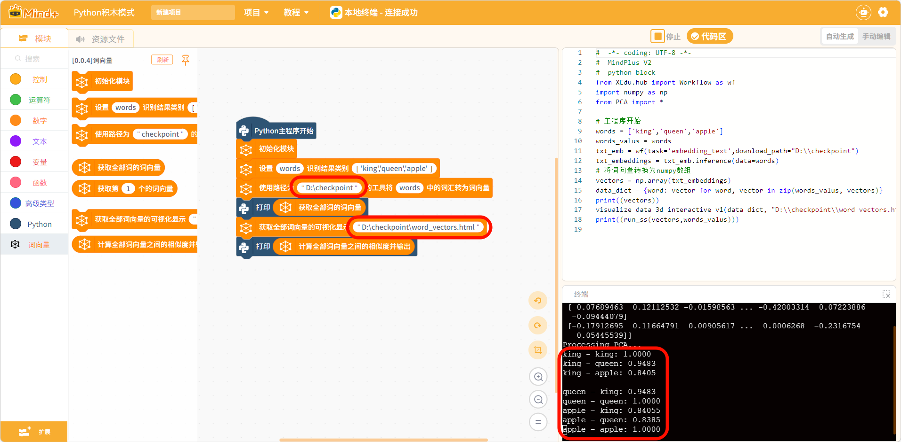

# 词向量扩展库

## 简介
用于在 Mind+ Python 模式下进行词向量（Word Embedding）处理的扩展库。本扩展基于 BERT 模型，可以将文本词汇转换为高维向量表示，支持词向量可视化和相似度计算，适用于自然语言处理和人工智能教学场景。

- 扩展 ID：berttext
- 版本：0.0.4
- 作者：Nick
- 模式：Python 积木模式（python-block）

## 版本更新记录

| 版本 | 更新日期 | 更新内容 | 
| --- | --- | --- | 
| 0.0.4 | 2026-03-19 | Mind+ V1 到 V2 适配 | 

## 适用硬件
| 设备 | 是否支持 |
| --- | --- |
| 电脑（Windows/macOS/Linux） | ✓ |
| UNIHIKER 行空板 | ✓ |
| 树莓派 | ✓ |

> 本扩展为纯软件扩展，不需要外接硬件传感器，适用于支持 Python 环境的设备。

## 功能概览
提供以下积木能力：
| opcode | 能力说明 |
| --- | --- |
| init | 初始化词向量模块 |
| readcap1 | 设置词汇列表和识别类别 |
| readcapq | 使用指定路径的模型将词汇转为词向量 |
| readcap1a1 | 获取所有词的词向量 |
| readcap1a | 获取指定位置的词向量 |
| readcap1b | 生成词向量的可视化显示文件 |
| readcap2 | 计算所有词向量之间的相似度 |

## 依赖库说明
本扩展依赖以下 Python 库：
- **xedu-python**：XEdu 人工智能教育库
- **plotly**：交互式可视化库
- **scikit-learn**：机器学习库（用于 PCA 降维）
- **onnxruntime**：ONNX 模型推理引擎

这些库在首次使用扩展时会自动安装。

## 积木说明

### 初始化模块
- **初始化模块**：在使用词向量功能前必须先调用，用于初始化模块环境。

### 配置类
- **设置 [变量名] 识别结果类别 [词汇列表]**：设置要处理的词汇列表。
  - `变量名`：存储词汇列表的变量名（如 words）
  - `词汇列表`：用逗号分隔的词汇，如 `'king','queen','apple'`

- **使用路径为 [模型路径] 的工具将 [变量名] 中的词汇转为词向量**：使用 BERT 模型将词汇转换为向量。
  - `模型路径`：BERT 模型文件所在目录（如 checkpoint）
  - `变量名`：之前设置的词汇列表变量名

### 数据获取类
- **获取全部词的词向量**：返回所有词汇的词向量矩阵。
- **获取第 [序号] 个的词向量**：返回指定位置词汇的词向量（序号从 1 开始）。

### 可视化类
- **获取全部词向量的可视化显示 [文件路径]**：生成词向量的 3D 可视化 HTML 文件。
  - `文件路径`：输出的 HTML 文件名（如 word_vectors.html）

### 分析类
- **计算全部词向量之间的相似度并输出**：计算并返回词向量之间的余弦相似度矩阵。

## 积木图

## 教程示例
以电脑为例，演示如何使用词向量扩展：

### 第一步：导入文本嵌入模型
在将词汇转成词向量时,需要用到embedding_text.onnx模型。有以下几种使用方式:

**方式一:使用绝对路径(推荐)**
将模型下载到本地后,使用绝对路径指定模型位置,例如 `D:\checkpoint` 或 `C:\AI\checkpoint`,避免将大文件放入项目中。这种方式只需下载一次,后续使用非常方便。

**方式二:自动下载**
在联网条件下直接运行图形化指令,程序如果没有在电脑本地检测到模型,会自动从云端下载。

> **注意**：不建议将 checkpoint 模型文件夹放入项目资源文件中,因为模型文件较大,会导致项目保存和加载异常。

### 第二步：词转词向量并打印

可以使用以下代码，将词汇表中的每一个词转成词向量并打印输出。获取全部词向量的输出是一个二维数组，里面依次放了每一个词向量，每一个词向量是一个长度为512的一维数组，这是因为文本嵌入模型从词中提取了512个特征并转成了数字化输出。

### 第三步，词向量可视化观察

由于词向量是一个数组，比较抽象，使用以下程序，可以将转成的词向量转成三维坐标系的一个点，帮助直观的观察各个词向量之间的关系

导出html文件并打开，可以观察词向量在三维空间坐标系的位置，这个空间可以理解为是语义空间。这个html文档可以用鼠标进行互动，在语义空间中词义相似的词向量，分布位置接近

### 第四步，向量之间的相似度计算

使用以下指令计算词向量之间的余弦相似度，余弦相似度越近，词义相似度越高

## 常见问题

**Q: 提示找不到模型文件？**
- A: 请确保 checkpoint 目录存在且包含 BERT 模型文件。可从 XEdu 官网下载预训练模型。

**Q: 词向量计算很慢？**
- A: BERT 模型推理需要一定计算资源，建议在性能较好的电脑上运行，或减少词汇数量。

**Q: 可视化文件打不开？**
- A: 请使用 Chrome、Edge、Firefox 等现代浏览器打开 HTML 文件。

**Q: 相似度结果不符合预期？**
- A: 词向量的语义相似度取决于模型训练数据，建议使用常见词汇进行测试。

