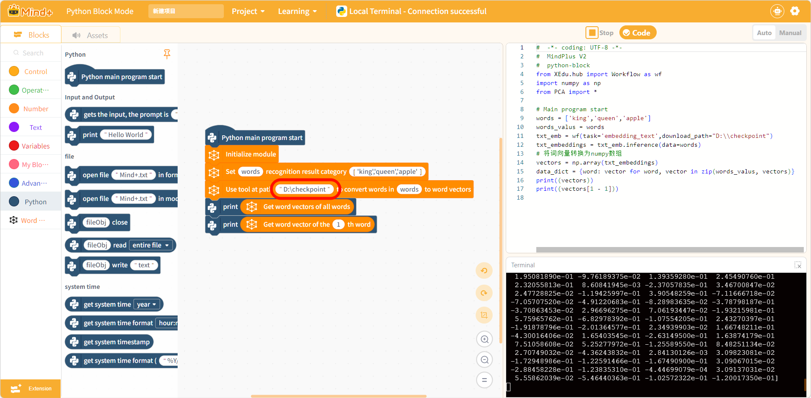

# Word Embedding Extension

## Introduction
An extension library for word embedding (Word Embedding) processing in Mind+ Python mode. This extension is based on the BERT model and can convert text vocabulary into high-dimensional vector representations, supporting word vector visualization and similarity calculation, suitable for natural language processing and AI teaching scenarios.

- Extension ID: berttext
- Version: 0.0.4
- Author: Nick
- Mode: Python Block Mode (python-block)

## Version Update History

| Version | Update Date | Update Content | 
| --- | --- | --- | 
| 0.0.4 | 2026-03-19 | Mind+ V1 to V2 adaptation | 

## Compatible Hardware
| Device | Supported |
| --- | --- |
| Computer (Windows/macOS/Linux) | ✓ |
| UNIHIKER Board | ✓ |
| Raspberry Pi | ✓ |

> This extension is a pure software extension that does not require external hardware sensors and is suitable for devices that support Python environment.

## Feature Overview
Provides the following block capabilities:
| opcode | Description |
| --- | --- |
| init | Initialize word vector module |
| readcap1 | Set vocabulary list and recognition categories |
| readcapq | Convert words to word vectors using model from specified path |
| readcap1a1 | Get word vectors for all words |
| readcap1a | Get word vector at specified position |
| readcap1b | Generate visualization file for word vectors |
| readcap2 | Calculate similarity between all word vectors |

## Dependency Libraries
This extension depends on the following Python libraries:
- **xedu-python**: XEdu AI education library
- **plotly**: Interactive visualization library
- **scikit-learn**: Machine learning library (for PCA dimensionality reduction)
- **onnxruntime**: ONNX model inference engine

These libraries will be automatically installed when using the extension for the first time.

## Block Description

### Initialization Module
- **Initialize Module**: Must be called before using word vector features to initialize the module environment.

### Configuration Class
- **Set [variable name] recognition result categories [vocabulary list]**: Set the vocabulary list to be processed.
  - `variable name`: Variable name to store the vocabulary list (e.g., words)
  - `vocabulary list`: Comma-separated words, e.g., `'king','queen','apple'`

- **Use tool at path [model path] to convert words in [variable name] to word vectors**: Use BERT model to convert words to vectors.
  - `model path`: Directory where BERT model files are located (e.g., checkpoint)
  - `variable name`: Previously set vocabulary list variable name

### Data Acquisition Class
- **Get word vectors for all words**: Returns the word vector matrix for all words.
- **Get word vector at position [index]**: Returns the word vector at the specified position (index starts from 1).

### Visualization Class
- **Get visualization display of all word vectors [file path]**: Generate a 3D visualization HTML file of word vectors.
  - `file path`: Output HTML file name (e.g., word_vectors.html)

### Analysis Class
- **Calculate and output similarity between all word vectors**: Calculate and return the cosine similarity matrix between word vectors.

## Block Diagram

## Tutorial Examples
Using a computer as an example to demonstrate how to use the word vector extension:

### Step 1: Import Text Embedding Model
When converting words to word vectors, the embedding_text.onnx model is required. There are the following usage methods:

**Method 1: Using Absolute Path (Recommended)**
After downloading the model locally, use an absolute path to specify the model location, such as `D:\checkpoint` or `C:\AI\checkpoint`, to avoid putting large files in the project. This method only requires downloading once and is very convenient for subsequent use.

**Method 2: Automatic Download**
When connected to the internet, run the graphical instructions directly. If the program does not detect the model locally on the computer, it will automatically download from the cloud.

> **Note**: It is not recommended to put the checkpoint model folder into the project resource files, as the model files are large and will cause abnormal project saving and loading.

### Step 2: Convert Words to Word Vectors and Print

You can use the following code to convert each word in the vocabulary to a word vector and print the output. The output of getting all word vectors is a two-dimensional array, which contains each word vector in sequence. Each word vector is a one-dimensional array of length 512, because the text embedding model extracts 512 features from words and converts them into numerical output.

### Step 3: Word Vector Visualization Observation

Since word vectors are arrays and relatively abstract, using the following program, you can convert the word vectors into points in a three-dimensional coordinate system, which helps to intuitively observe the relationship between word vectors.

Export and open the HTML file to observe the position of word vectors in the three-dimensional space coordinate system. This space can be understood as semantic space. This HTML document can be interacted with using the mouse. In the semantic space, word vectors with similar meanings are distributed close to each other.

### Step 4: Similarity Calculation Between Vectors

Use the following instructions to calculate the cosine similarity between word vectors. The closer the cosine similarity, the higher the semantic similarity.

## FAQ

**Q: Prompt that model file cannot be found?**
- A: Please ensure that the checkpoint directory exists and contains BERT model files. Pre-trained models can be downloaded from the XEdu official website.

**Q: Word vector calculation is slow?**
- A: BERT model inference requires certain computing resources. It is recommended to run on a computer with better performance or reduce the number of words.

**Q: Visualization file cannot be opened?**
- A: Please use modern browsers such as Chrome, Edge, Firefox to open HTML files.

**Q: Similarity results do not meet expectations?**
- A: The semantic similarity of word vectors depends on the model training data. It is recommended to use common words for testing.

